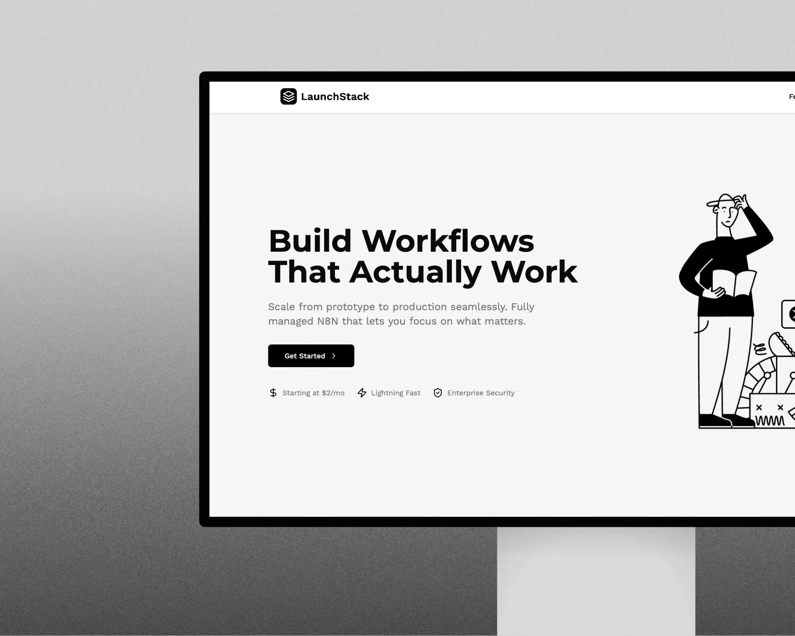

# LaunchStack - n8n Hosting Service

LaunchStack is a professional n8n hosting service that offers dedicated resources, unlimited workflows, and 99.9% uptime guarantee at affordable prices starting at just $2/month.



## Table of Contents

- [Overview](#overview)
- [Features](#features)
- [Tech Stack](#tech-stack)
- [Project Structure](#project-structure)
- [Development](#development)
- [Deployment](#deployment)
- [Docker Deployment](#docker-deployment)
- [Server Requirements](#server-requirements)

## Overview

LaunchStack provides a reliable and secure hosting solution for n8n workflows. The platform is designed to be user-friendly, cost-effective, and highly scalable, catering to individual users and businesses of all sizes.

## Features

- **Affordable Pricing**: Plans starting at just $2/month
- **Automatic Updates**: Stay on the latest version of n8n
- **Dedicated Support**: Priority support from n8n experts
- **Enhanced Security**: Enterprise-grade security and regular backups
- **Custom Domain**: Use your own domain for your n8n instance
- **Scalable Resources**: Scale resources based on workflow demands

## Tech Stack

- **Framework**: Next.js 13.5.1 (App Router)
- **Language**: TypeScript
- **Styling**: Tailwind CSS
- **UI Components**: shadcn/ui
- **Animations**: Framer Motion
- **Icons**: Lucide React
- **Form Handling**: React Hook Form with Zod validation
- **Deployment**: Docker with Alpine Node.js

## Project Structure

```
LaunchStack/
├── app/                  # Next.js App Router pages
│   ├── page.tsx          # Home page
│   ├── layout.tsx        # Root layout
│   ├── about/            # About page
│   ├── contact/          # Contact page
│   ├── features/         # Features page
│   ├── pricing/          # Pricing page
│   ├── privacy/          # Privacy policy
│   ├── security/         # Security page
│   └── terms/            # Terms page
├── components/           # React components
│   ├── ui/               # UI components from shadcn/ui
│   ├── header.tsx        # Site header
│   ├── footer.tsx        # Site footer
│   └── ...               # Other components
├── public/               # Static assets
│   └── images/           # Image assets
├── lib/                  # Utility functions and constants
├── Dockerfile            # Docker configuration
├── docker-compose.yml    # Docker Compose configuration
├── next.config.js        # Next.js configuration
└── tailwind.config.ts    # Tailwind CSS configuration
```

## Development

### Prerequisites

- Node.js 18 or later
- npm or yarn

### Installation

1. Clone the repository:
   ```bash
   git clone https://github.com/yourusername/LaunchStack.git
   cd LaunchStack
   ```

2. Install dependencies:
   ```bash
   npm install
   ```

3. Start the development server:
   ```bash
   npm run dev
   ```

4. Open [http://localhost:3000](http://localhost:3000) in your browser.

## Deployment

### Build for Production

```bash
npm run build
```

The build output will be in the `launch-stack` directory as configured in `next.config.js`.

### Start Production Server

```bash
npm start
```

## Docker Deployment

LaunchStack can be deployed using Docker for a consistent and isolated environment.

### Using Docker

1. Build the Docker image:
   ```bash
   docker build -t launch-stack:latest .
   ```

2. Run the container:
   ```bash
   docker run -d -p 3000:3000 --name launch-stack launch-stack:latest
   ```

### Using Docker Compose

1. Start the services:
   ```bash
   docker-compose up -d
   ```

2. View logs:
   ```bash
   docker-compose logs -f
   ```

### Server Proxy Configuration (Caddy)

For production deployment with Caddy as a reverse proxy:

```
launch-stack.srvr.site {
    import tls_config
    
    # Reverse proxy to your Docker container or Node.js server
    reverse_proxy localhost:3000
}
```

## Server Requirements

### Minimum Requirements
- **CPU**: 1 core
- **RAM**: 512MB
- **Storage**: 1GB

### Recommended Requirements
- **CPU**: 2+ cores
- **RAM**: 1GB+
- **Storage**: 5GB+

### Node.js Server
- **Version**: Node.js 18 LTS or later
- **Packages**: npm or yarn
- **Process Manager**: PM2 recommended for production

### Docker Environment
- **Docker**: 20.10.x or later
- **Docker Compose**: 2.x or later

## Notes on Next.js App Router and Server Components

This project uses Next.js App Router with React Server Components. This architecture:

1. Renders components on the server by default
2. Reduces JavaScript sent to the client
3. Improves performance and SEO
4. Requires a Node.js runtime for deployment

Components marked with "use client" directive at the top run on the client side, while all other components run on the server by default.

```tsx
// Client component example
"use client";

import { useState } from "react";

export default function ClientComponent() {
  const [count, setCount] = useState(0);
  return <button onClick={() => setCount(count + 1)}>{count}</button>;
}
``` 